# Stage E – Graphical User Interface for the Database

## Yedidim Family Assistance System

## 1. Introduction

This project implements a graphical user interface for the Yedidim Family Assistance database system.
The application was developed in **Python** using **CustomTkinter** for the graphical interface and **psycopg2** for the connection to a **PostgreSQL** database.

---

## 2. Technologies Used

* **Python**
* **CustomTkinter**
* **Tkinter Treeview**
* **PostgreSQL**
* **psycopg2**
* **tkintermapview**
* **Docker / pgAdmin** for database management
* **Git / GitHub** for version control

---

## 3. Application Structure

The application starts from a main dashboard and includes a sidebar menu that allows the user to navigate between all system screens.

Main screens:

* Dashboard
* Families
* Volunteers
* Requests Management
* Request's Categories
* Locations / Dispatch Map
* Missions Treatments
* Deliveries
* Trainings
* Skills Registry
* Skill's Categories
* Reports & Procedures

Screenshot of the main navigation:

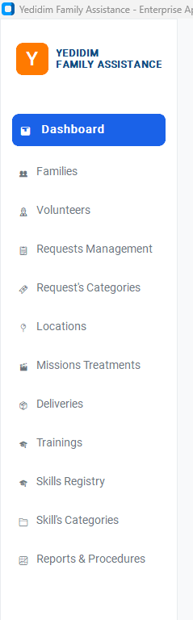

---

## 4. Database Connection

The application connects to the PostgreSQL database using a shared connection object.

Example configuration:

```python
DB_HOST = "localhost"
DB_NAME = "finaldb"
DB_USER = "ochrith"
DB_PASSWORD = "ochrith"
DB_PORT = "5432"
```

The connection is created once in the main application and passed to each screen.
This allows all screens to work with the same database connection.

---

## 5. Dashboard Screen

The Dashboard is the main entry screen of the system.
It displays live operational information about the database.

The dashboard includes:

* Total number of requests
* Number of active missions
* Total number of volunteers
* Number of completed treatments today
* Critical pending alerts
* Top 10 volunteers by number of completed missions

The dashboard refreshes automatically and reflects changes made in other screens.

For example, when a new treatment is created through the dispatch system, the number of active missions is updated.

Screenshot:

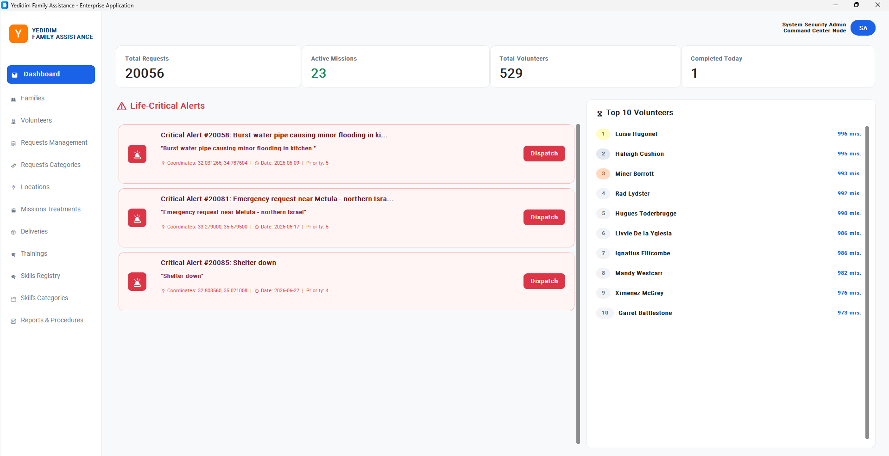

---

## 6. Families Screen

The Families screen allows the user to manage the `a_family` table.

Supported operations:

* Read families from the database
* Add a new family
* Update an existing family
* Delete a family
* Search by family ID, contact person name, or phone number

The user can manually enter the family ID.
If the entered family ID already exists, the form displays an error message in red.
The same validation exists for duplicate phone numbers.

The table used:

```sql
a_family(
    contactperson_id,
    contactperson_name,
    phone_number,
    number_of_members,
    special_features
)
```

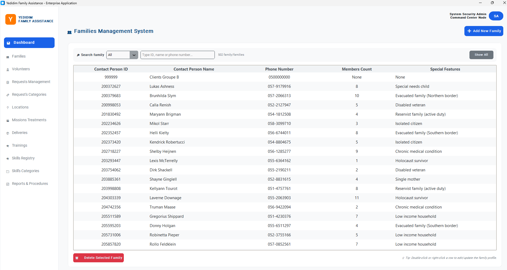  


Double-clicking on a family in the list will open a dedicated update window, allowing you to modify their profile details.


We can also add or delete a family by clicking the associated button. The delete action only works if the family is not linked to any request.

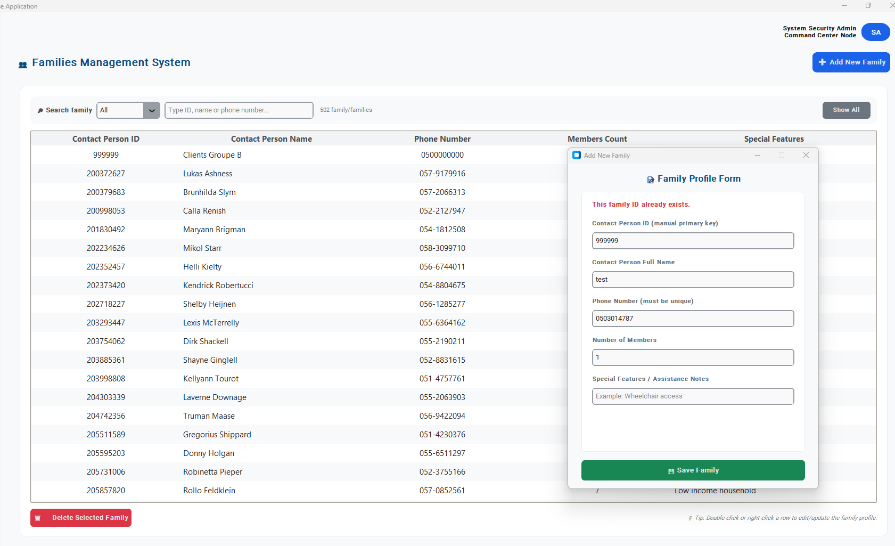

The delete action only works if the family is not linked to any request.


---

## 7. Volunteers Screen

The Volunteers screen manages the `a_volunteer` table.

Supported operations:

* Read volunteers
* Add a new volunteer
* Update volunteer details
* Delete a volunteer
* Search volunteer by ID, first name or last name
* View and manage the volunteer's skills

The screen also provides access to the volunteer skills relation through the `b_volunteer_skill` table.
This allows assigning or removing skills from a volunteer.

Related tables:

```sql
a_volunteer
b_volunteer_skill
b_skill
```

Screenshot:

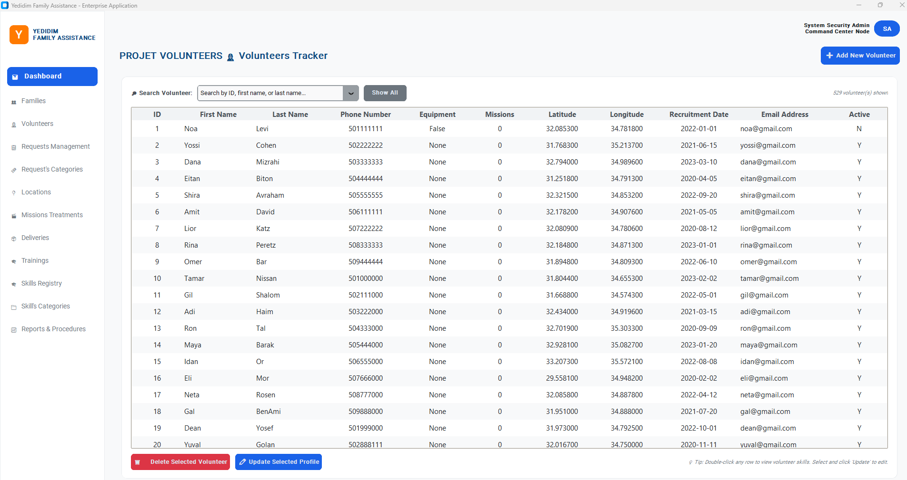 


Double-clicking a volunteer opens a dedicated management window that displays all their registered skills, allowing you to seamlessly add, update, or delete them. We also added a button to automatically redirect the user from the volunteer profile popup to the main skills screen.


---

## 8. Requests Management Screen

The Requests screen manages assistance requests in the system.

Supported operations:

* Read requests
* Add new request
* Update request information
* Delete request
* Search and filter requests

The request table is connected to families and request categories using foreign keys.
Instead of relying only on numeric IDs, the interface uses joins to display meaningful information such as contact person and category names when relevant.

Main table:

```sql
a_request
```
Screenshot:

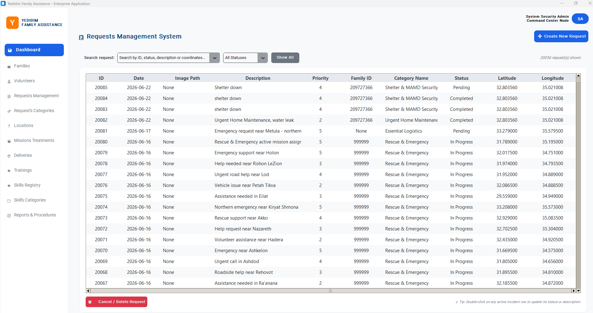

We have a search bar to filter requests by any attribute, and also a combo box to filter them by status. 


This is the formular to add a request. 


Double-clicking on a request in the list will open a dedicated update window, allowing you to modify their details.


When deleting, this message is displayed.


---

## 9. Request Categories Screen

The Request Categories screen manages the types of requests handled by the system.

Examples of request categories:

* Rescue & Emergency
* Shelter & MAMD Security
* Essential Logistics
* Urgent Home Maintenance
* Flat Tire Assistance
* Locked Vehicle
* Child Locked In Car

This screen allows the user to view and manage request categories.

Related table:

```sql
a_requestcategory
```

Screenshot:

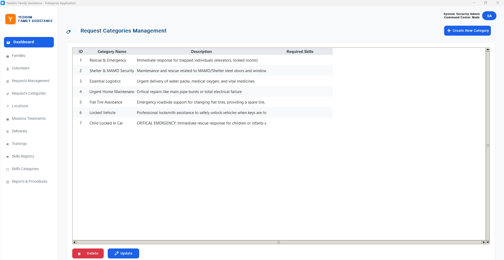

This is the formular to add a new category.


---

## 10. Skills Registry and Skill Categories Screens

The Skills Registry screen manages the `b_skill` table.
The Skill Categories screen manages the skill category table.

Main skill categories:

* Language
* Vehicle
* Locksmith
* Rescue
* Technical
* Emergency

The Skills Registry includes skills such as:
Related tables:

```sql
b_skill
b_catagory
```

Screenshots:

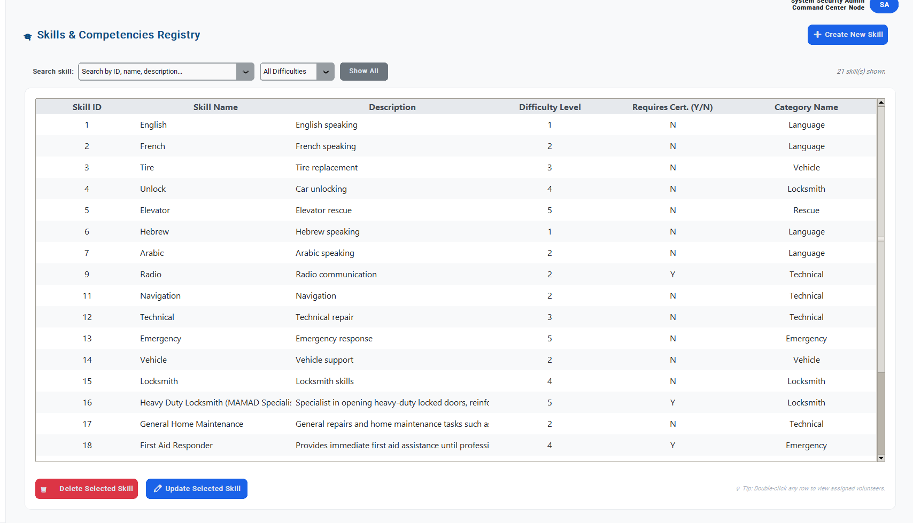

This is the formular to add a new request category. The ID is automatically generated. 


Double-click any skill row to open a window displaying all volunteers who possess that specific skill.


The Skill Category view simply displays each skill category alongside its corresponding category name

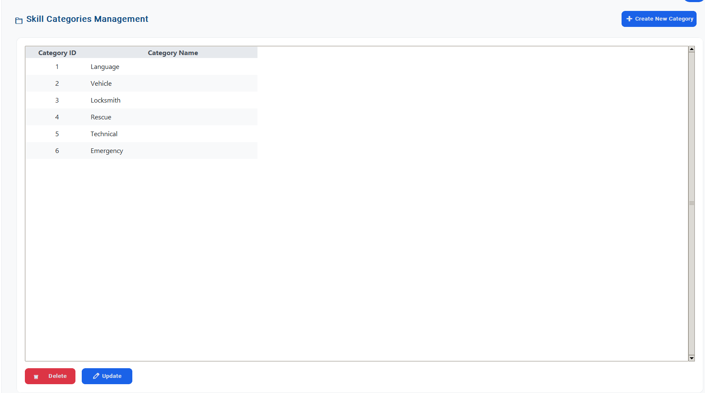

---

## 11. Required Skills Mapping

In order to improve the dispatch logic, we added a dedicated table that maps request categories to exact required skills.

Instead of using only broad skill categories such as “Technical”, the system now uses exact `skill_id` values.

Table:

```sql
request_category_required_skill(
    request_category_id,
    skill_id
)
```

This prevents incorrect matches.
For example, a Certified Electrician should not automatically match a MAMD shelter request only because both are technical.
Instead, a MAMD request requires specific skills such as:

* Heavy Duty Locksmith / MAMAD Specialist
* Locksmith skills
* Emergency response
* Hydraulic Tools Expert

This makes volunteer matching more accurate and more logical.

---

## 12. Location and Dispatch Map Screen

The Location / Dispatch feature is one of the main operational features of the application.

When a critical pending request appears in the dashboard, the user can click the **Dispatch** button.
The system opens a map showing volunteers around the request location.

The dispatch logic checks:

* Volunteer distance from the request
* Volunteer equipment availability
* Volunteer busy status
* Matching skills based on `request_category_required_skill`
* Existing active treatments

The map displays up to 10 volunteers.
The selection is done by distance perimeters:

1. Volunteers within 5 km
2. Volunteers within 10 km
3. Volunteers within 15 km
4. If there are still fewer than 10 volunteers, the system completes with farther volunteers

Inside each perimeter, volunteers with matching skills are prioritized.

Marker colors:

* Green: close volunteer with required skill
* Gray: close volunteer without required skill
* Orange: medium-distance volunteer
* Red: farther volunteer
* Yellow: request location

When the user clicks a volunteer marker, the system displays:

* Volunteer name
* Phone number
* Distance from the request
* Availability status
* Matching skills
* All volunteer skills

The user can assign the selected volunteer to the request.
This creates a new treatment and updates the request status to “In Progress”.

Related tables:

```sql
a_request
a_volunteer
a_treatment
b_volunteer_skill
b_skill
request_category_required_skill
```

Screenshot:

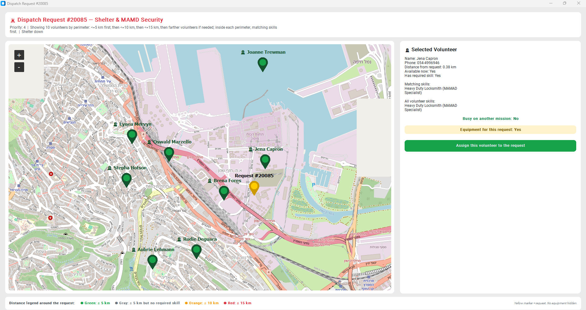

---

## 13. Missions Treatments Screen

The Treatments screen manages missions that were assigned to volunteers.

Supported operations:

* Read treatments
* Create new treatment
* Update treatment
* Delete treatment
* Search by treatment ID, request ID, volunteer ID, volunteer name, date, feedback or description

The screen uses joins with volunteers and requests in order to display meaningful information and support easier search.

Main table:

```sql
a_treatment
```
When a treatment is created, the related request can move to “In Progress”.
When a treatment is completed, the completion time is filled and the request can become completed.

Screenshot:
Search treatment with his number or his volunteer name:

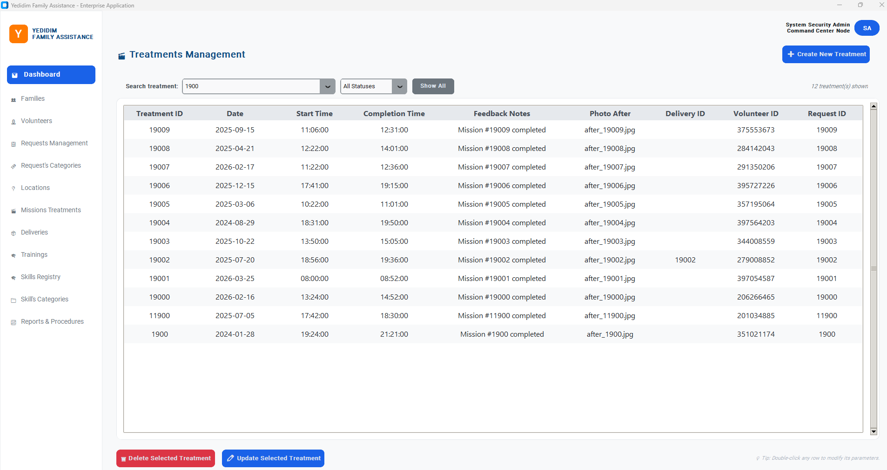

When creating a new treatment, you must associate it with an existing pending request by selecting it from the combo box menu. There is a second combo box to choose the assigned volunteer who is available now. Next, simply fill in the required details, and the new record will be added to the management list.


---

## 14. Deliveries Screen

The Deliveries screen manages deliveries linked to treatments.

Supported operations:

* Read deliveries
* Create delivery
* Update delivery
* Delete delivery
* Search and filter by status or item type
* Assign delivery to an active treatment

Main table:

```sql
a_delivery
```
The screen verifies that a delivery is linked to an active treatment when needed.

Screenshot:

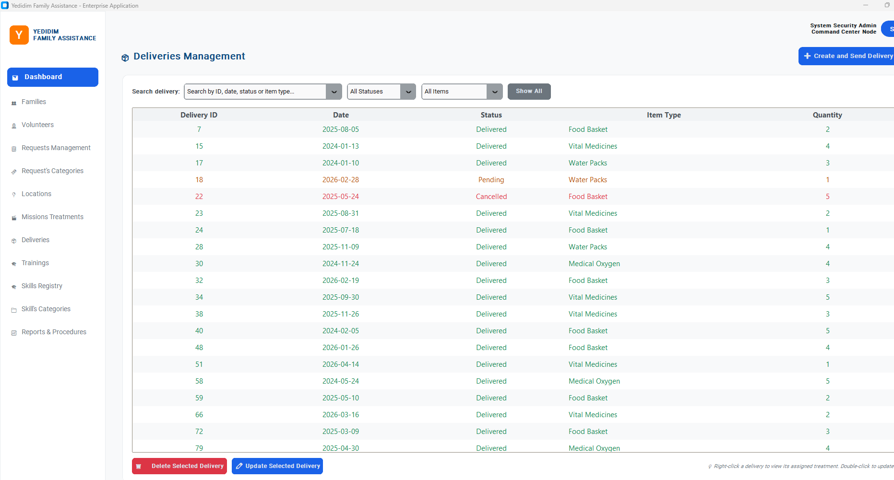

When creating a new delivery, you must associate it with an existing active treatment by selecting it from the combo box  menu. Then, simply fill in the required details, and the new record will be added to the management list.

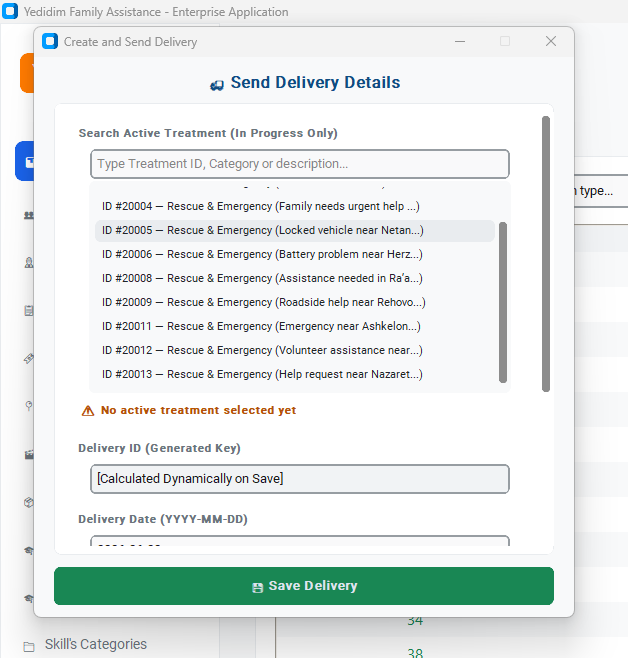

---

## 15. Trainings Screen

The Trainings screen manages volunteer trainings and schedules.

Supported operations:

* Read trainings
* Add training
* Update training
* Delete training
* Show schedule information
* Add or remove volunteers from trainings

Related tables:

```sql
b_training
b_scheduled
b_volunteer_training
```

This screen allows indirect management of training schedules and volunteer participation.

Screenshot:

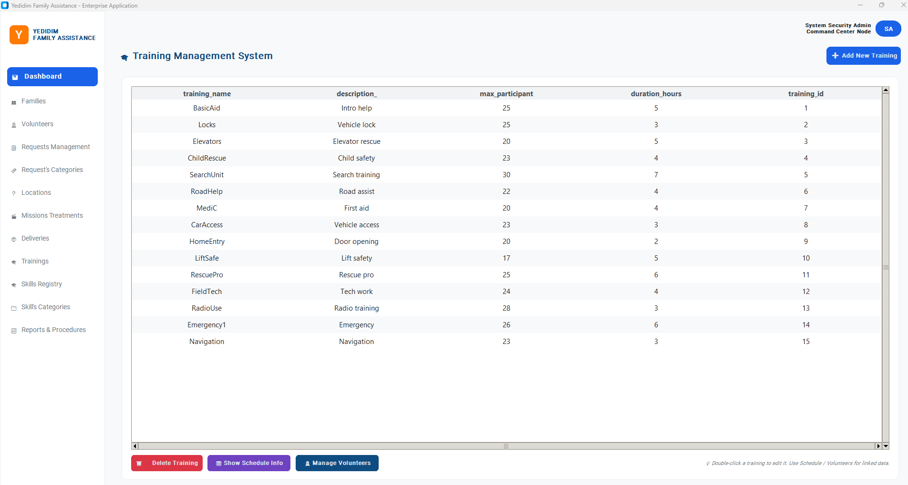

Clicking 'Manage Volunteers' for a selected Training ID will display a dedicated list of all volunteers who have been registered for that specific training course.


---


## Location Screen – Active Field Missions Map

The Location screen provides a real-time geographic view of the active missions currently taking place in the field.

This screen is different from the Dispatch popup.
The Dispatch popup is used to assign a volunteer to a pending request, while the Location screen is used to monitor missions that are already active.

The Location screen displays active treatments from the database, meaning treatments where:

```sql
completion_time IS NULL
```

For each active treatment, the system retrieves information from several related tables:

```sql
a_treatment
a_volunteer
a_request
a_requestcategory
```

The screen displays both the volunteer location and the request location on a map.
This allows the operator to see where volunteers are currently working and how far they are from the families or requests they are helping.

The screen includes:

* A list of active missions
* A map showing field locations
* Volunteer markers
* Request markers
* Distance calculation between volunteer and request
* Mission duration calculation
* Filters for priority, long missions and missing coordinates
* Search by volunteer name, phone number, request ID or treatment information

The distance between the volunteer and the request is calculated using the Haversine formula.
This helps the system estimate how far the volunteer is from the request location.

The Location screen also uses visual indicators:

* Critical priority missions are highlighted in red
* Long treatments are highlighted in yellow/orange
* Active normal treatments are highlighted in green
* Missions with missing coordinates are highlighted in gray
* The request marker is displayed clearly so that it remains visible on the map

This screen is useful for operational supervision.
It helps the system administrator understand which volunteers are currently active, where they are located, and which requests are being handled in real time.

Screenshot:

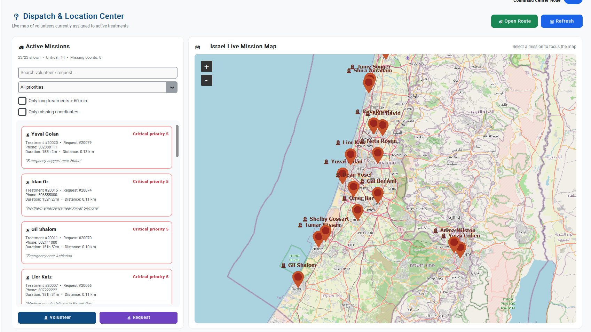
The Location screen also provides interactive map actions. 
Each volunteer marker can be clicked. 
When the operator clicks on a volunteer, the system displays the volunteer's details, including name, phone number,
current treatment, request information and distance from the request location. 
The map also automatically centers and zooms in on the selected volunteer's position, allowing the operator to 
quickly locate them on the field map. 
From the details panel, the operator can use the call option to contact the volunteer directly from the interface.
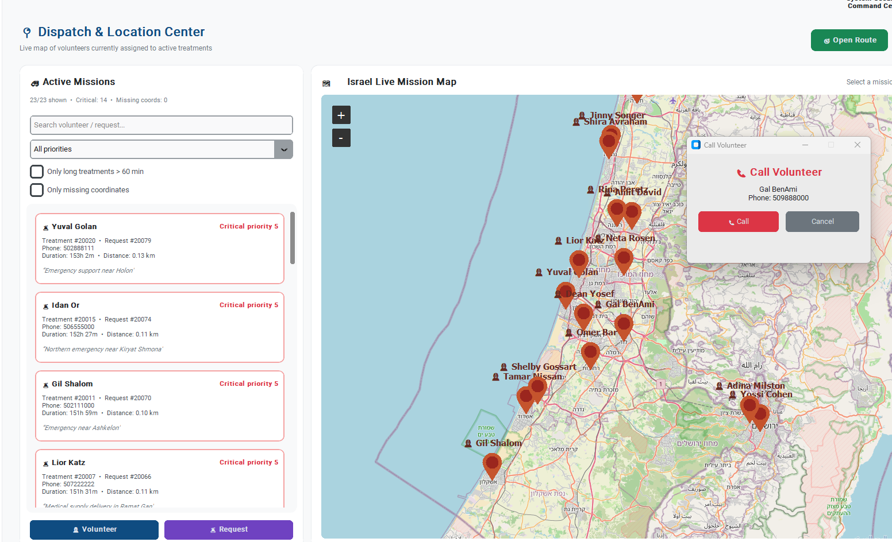

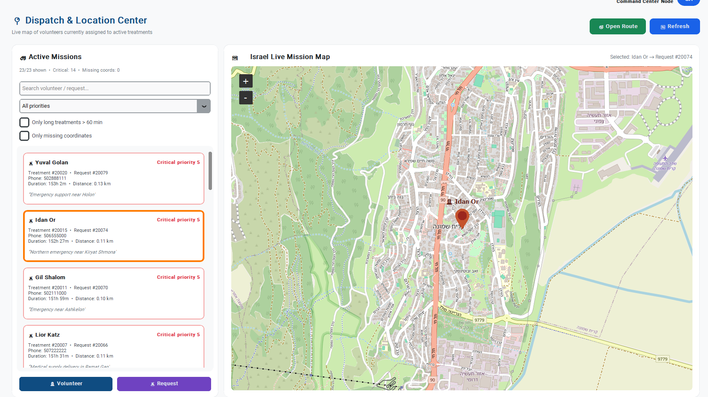


## 16. Reports & Procedures Screen

The Reports & Procedures screen was created specifically for Stage E requirements.

It allows the user to run analytical queries from Stage B and database subprograms from Stage D directly from the graphical interface.

The screen is divided into two parts:

1. Stage B analytical queries
2. Stage D functions and procedures

The results are displayed in a user-friendly table.

Screenshot:

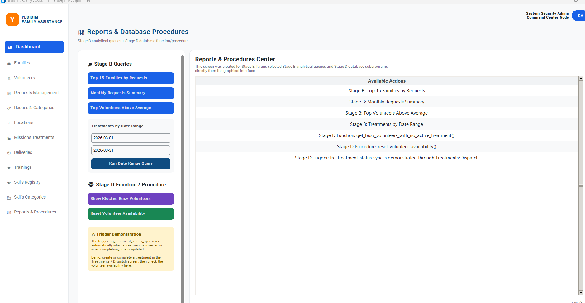
Procedure 1:
[Reports and procedures screen](images/reportTopVolunteer.png)

---

## 17. Stage B Queries Implemented in the Interface

### Query 1: Top 15 Families by Number of Requests

This query displays the families that created the highest number of requests.

```sql
SELECT 
    f.contactperson_id,
    f.contactperson_name,
    COUNT(r.request_id) AS total_requests
FROM public.a_family f
JOIN public.a_request r 
    ON f.contactperson_id = r.contactperson_id
GROUP BY f.contactperson_id, f.contactperson_name
ORDER BY total_requests DESC
LIMIT 15;
```

Displayed columns:

* Contact person ID
* Contact person name
* Total requests

Purpose: identify families that require frequent assistance.

---

### Query 2: Monthly Requests Summary

This query groups requests by month and year.

```sql
SELECT 
    TO_CHAR(date, 'Month') AS month_name,
    EXTRACT(YEAR FROM date) AS year_nb,
    COUNT(*) AS nb_requests
FROM public.a_request
GROUP BY year_nb, month_name, EXTRACT(MONTH FROM date)
ORDER BY year_nb DESC, EXTRACT(MONTH FROM date) DESC;
```

Displayed columns:

* Month
* Year
* Number of requests

Purpose: analyze request activity over time.

---

### Additional Query: Top Performing Volunteers

This query displays volunteers whose mission counter is above the average.

```sql
SELECT first_name, last_name, counter
FROM public.a_volunteer
WHERE counter > (SELECT AVG(counter) FROM public.a_volunteer)
ORDER BY counter DESC;
```

Purpose: identify high-performing volunteers.

---

### Additional Query: Treatments by Date Range

This query allows the user to search treatments between two dates.

```sql
SELECT 
    t.treatment_id,
    t.date,
    t.feedback_notes,
    v.first_name || ' ' || v.last_name AS volunteer_name
FROM public.a_treatment t
JOIN public.a_volunteer v 
    ON v.volunteer_id = t.volunteer_id
WHERE t.date BETWEEN %s AND %s
ORDER BY t.date ASC;
```

Purpose: review treatments performed during a selected period.

---

## 18. Stage D Function and Procedure Used in the Interface

### Function: get_busy_volunteers_with_no_active_treatment()

This function returns volunteers that are marked as busy but do not actually have an active treatment.

A volunteer is considered incorrectly blocked if:

```text
a_volunteer.is_active = 'Y'
AND
there is no active treatment with completion_time IS NULL
```

Function:

```sql
CREATE OR REPLACE FUNCTION public.get_busy_volunteers_with_no_active_treatment()
RETURNS REFCURSOR
LANGUAGE plpgsql
AS $$
DECLARE
    volunteer_ref_cursor REFCURSOR := 'busy_volunteers_cursor';
BEGIN
    OPEN volunteer_ref_cursor FOR
        SELECT 
            v.volunteer_id,
            v.first_name,
            v.last_name,
            v.is_active
        FROM public.a_volunteer v
        WHERE v.is_active = 'Y'
          AND NOT EXISTS (
              SELECT 1 
              FROM public.a_treatment t 
              WHERE t.volunteer_id = v.volunteer_id
                AND t.completion_time IS NULL
          );

    RETURN volunteer_ref_cursor;

EXCEPTION
    WHEN OTHERS THEN
        RAISE EXCEPTION 'Error while opening the blocked volunteers cursor : %', SQLERRM;
END;
$$;
```

In the graphical interface, the button **Show Blocked Busy Volunteers** runs this function and displays the result.

---

### Procedure: reset_volunteer_availability()

This procedure calls the function above and fixes the inconsistent volunteers.

For each blocked volunteer, it updates:

```sql
is_active = 'N'
```

Procedure:

```sql
CREATE OR REPLACE PROCEDURE public.reset_volunteer_availability()
LANGUAGE plpgsql
AS $$
DECLARE
    v_cursor REFCURSOR;
    v_record RECORD;
    v_counter INTEGER := 0;
BEGIN
    v_cursor := public.get_busy_volunteers_with_no_active_treatment();

    LOOP
        FETCH v_cursor INTO v_record;
        EXIT WHEN NOT FOUND;

        UPDATE public.a_volunteer
        SET is_active = 'N'
        WHERE volunteer_id = v_record.volunteer_id;

        v_counter := v_counter + 1;

        RAISE NOTICE 'Yedidim Notification: Volunteer % % (ID: %) has been released from their block.',
                     v_record.first_name, v_record.last_name, v_record.volunteer_id;
    END LOOP;

    CLOSE v_cursor;

    RAISE NOTICE 'Procedure completed successfully. Total volunteers corrected and released: %', v_counter;

EXCEPTION
    WHEN OTHERS THEN
        RAISE EXCEPTION 'Critical error during procedure execution: %', SQLERRM;
END;
$$;
```

In the interface, the button **Reset Volunteer Availability** executes the procedure and displays PostgreSQL notices returned by `RAISE NOTICE`.

---

## 19. Trigger Used in the System

The system also includes a trigger that synchronizes volunteer availability with treatments.

Trigger function:

```sql
update_volunteer_status_on_treatment()
```

Trigger:

```sql
trg_treatment_status_sync
```

It runs after insert or update of `completion_time` on `a_treatment`.

Behavior:

* When a treatment is inserted without completion time, the volunteer becomes busy:

  ```sql
  is_active = 'Y'
  ```

* When the treatment receives a completion time, the volunteer becomes available:

  ```sql
  is_active = 'N'
  ```

This trigger is not executed manually from the interface.
It is activated automatically when the user creates or updates a treatment.

This effect can be observed through:

* Dispatch screen
* Treatments screen
* Volunteers screen
* Dashboard active missions counter

---


## 21. Foreign Keys and User-Friendly Display

The interface avoids showing only numeric foreign key values when possible.
Instead, it uses joins to show meaningful information.

Examples:

* Volunteer ID is displayed with volunteer name
* Request category ID is displayed with category name
* Treatment search supports volunteer names
* Dispatch map displays volunteer names and skills
* Training participants are shown by volunteer details

This improves readability and makes the system easier to use.

---

## 22. Example Workflow

A typical workflow in the system:

1. A family is registered in the Families screen.
2. A new emergency request is created in Requests Management.
3. The request appears in the Dashboard if it is critical and pending.
4. The user clicks Dispatch.
5. The map opens and displays suitable volunteers.
6. The user selects a volunteer.
7. The system creates a new treatment.
8. The request status becomes In Progress.
9. The volunteer becomes busy.
10. When the mission is completed, the treatment is updated with a completion time.
11. The volunteer becomes available again.
12. The dashboard counters are refreshed.

This workflow demonstrates the interaction between the graphical interface, SQL queries, foreign keys, procedures and triggers.


---

## 24. Error Handling and Validation

The application includes validation and error handling.

Examples:

* Preventing duplicate family ID
* Preventing duplicate phone number
* Checking required fields before insert
* Confirming delete operations
* Handling foreign key constraints
* Preventing assignment of a busy volunteer
* Checking if a request already has an active treatment
* Displaying database errors in message boxes

---

## 25. Conclusion

Stage E provides a complete graphical interface for the Yedidim Family Assistance database system.

The application allows users to manage the main database tables, perform CRUD operations, run analytical queries from Stage B, and execute functions and procedures from Stage D.

The system also includes an advanced dispatch map that helps choose volunteers according to distance, equipment, availability and required skills.

Overall, the project demonstrates the connection between a relational PostgreSQL database and a practical graphical application.
